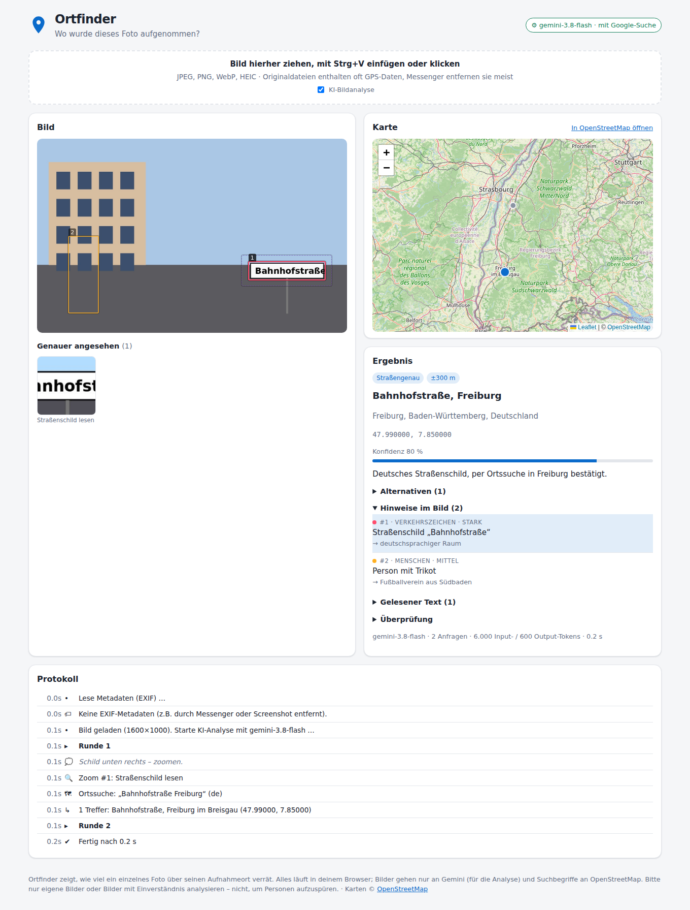

# Ortfinder

**Wo wurde dieses Foto aufgenommen?** Ortfinder ist eine Art extrem gründlicher GeoGuessr:
Du gibst ein beliebiges Foto hinein, und das Programm versucht so genau wie möglich
herauszufinden, wo es entstanden ist, bis hin zur Straße oder zum Standpunkt.

Ortfinder ist eine **reine Website** (HTML/JavaScript im Ordner [`docs/`](docs)) und läuft direkt auf
**GitHub Pages**, ganz ohne Server. Die KI-Analyse läuft **kostenlos und ohne API-Key über
[Puter](https://puter.com)** (Standard: Gemini 3.8 Flash); wer möchte, nutzt stattdessen einen von vielen
weiteren Anbietern – kostenlos (OpenRouter, Gemini, Mistral, Groq, eigener PC), mit Startguthaben (DeepSeek,
Qwen), mit PayPal bezahlt (Poe, DeepSeek) oder per Karte (Claude, OpenAI, xAI), siehe [KI-Anbieter](#ki-anbieter).

**Anleitungen zum Abtippen** für jede KI-Option, jeweils für Windows, macOS, Android und iPhone:
<https://germanclaude.github.io/Ortfinder/anleitung.html> (auch in Ortfinder unter ⚙, passend zur gewählten Option
und zum erkannten Gerät).



## Benutzung

**Direkt im Browser:** <https://germanclaude.github.io/Ortfinder/>

1. Ein Foto in das große Feld ziehen, mit Strg+V einfügen oder „Foto auswählen“ klicken.
2. Beim allerersten Foto einmalig auf **„Bei Puter anmelden (kostenlos)“** klicken und mit Google, Microsoft,
   Apple oder E-Mail anmelden. Danach läuft die Analyse automatisch weiter; beim nächsten Mal ist man
   schon angemeldet.
3. Live verfolgen, wohin die KI zoomt und was sie sucht. Ihre Zwischenstände erscheinen sofort auf der
   Karte, die von der Weltkarte aus immer weiter heranzoomt.
4. Am Ende zeigt die Karte zwei Punkte:
   - **📷 Standpunkt**: von hier wurde fotografiert (mit Unsicherheits-Areal),
   - **🎯 Motiv**: das ist auf dem Foto zu sehen,
   dazwischen den berechneten **Sichtbereich**. Darunter zeigt „Woran Ortfinder den Ort
   erkennt“ jeden Hinweis als Bildausschnitt: Verkehrszeichen, Schrift und Sprache, Symbole, Pflanzen,
   Architektur, Kleidung usw.

### Weiterrechnen, wenn Ortfinder nicht auf dem Bildschirm ist

- **Computer:** Die Analyse läuft in einem Hintergrund-Tab einfach weiter. Der Fortschritt steht im
  Tab-Titel, z.B. „(3/10) Ortfinder“, am Ende „✔ Ortfinder“.
- **Handy:** Sobald man die App wechselt oder der Bildschirm ausgeht, halten Browser eine Seite an und
  laden sie manchmal später neu. Eine Website kann das nicht verhindern, dafür bräuchte es einen Server.
  Ortfinder sorgt deshalb dafür, dass nichts verloren geht:
  - Nach jeder Runde wird der Stand im Browser gespeichert (IndexedDB). Wird die Seite neu geladen, geht
    die Analyse genau dort weiter, mit Protokoll, Zooms und Karte.
  - Bricht eine Anfrage ab, während die Seite im Hintergrund ist, wartet Ortfinder und wiederholt sie,
    sobald die Seite wieder sichtbar ist, statt mit Fehler abzubrechen.
  - Während der Analyse bleibt der Bildschirm an (Wake Lock), damit das Handy nicht sperrt.
- **Hängt die KI**, weil eine Anfrage ohne Fehler einfach nie beantwortet wird, fragt Ortfinder dieselbe
  Runde neu an oder wechselt das Modell. Wann eine Anfrage als hängend gilt, hängt davon ab, ob der Dienst
  seine Antwort Stück für Stück schickt: Bei DeepSeek, Mistral, Groq, Poe, OpenAI, xAI, Claude und Ollama
  zählt nur echte Stille (50 s ohne neue Daten, bei Claude 120 s, beim eigenen PC 180 s) – langes Nachdenken
  ist dort sichtbar und kein Abbruchgrund. Puter, OpenRouter und Gemini schicken die Antwort am Stück; dort
  wartet Ortfinder 90 s oder doppelt so lange wie die bisher langsamste Runde, damit keine fast fertige
  Antwort verworfen wird. Jeder weitere Versuch bekommt mehr Zeit; nach vier Versuchen kommt ein klarer
  Hinweis. Gebäudedaten (Overpass) haben 30 s je Server und 60 s insgesamt, Adress- und Websuche 15–20 s;
  ein Werkzeug gibt spätestens nach 120 s auf, und die KI arbeitet ohne dieses Ergebnis weiter.
- **Benachrichtigung:** Mit „🔔 Bescheid geben“ meldet sich Ortfinder, sobald das Ergebnis da ist,
  solange der Browser die Seite im Hintergrund laufen lässt (Computer, oft auch Android). Auf dem iPhone
  gehen Benachrichtigungen nur, wenn Ortfinder zum Home-Bildschirm hinzugefügt wurde.

## Wie es funktioniert

1. **Metadaten (EXIF).** Viele Originalfotos von Handys (auch iPhone-HEIC) enthalten GPS-Koordinaten.
   Sind sie vorhanden, ist der Ort exakt bekannt. Aufnahmezeit und Kamera werden ebenfalls ausgelesen.
2. **KI-Bildanalyse mit Werkzeugen.** Gemini untersucht das Bild wie ein GeoGuessr-Profi bzw.
   OSINT-Analyst und geht dabei systematisch alle Hinweise durch:
   - **Schrift & Sprache:** Sonderzeichen, Wörter, Telefonvorwahlen, Postleitzahlen, Domains, Währung
   - **Verkehrszeichen:** Form, Farbe, Schriftart, Ortsschilder, Wegweiser, Straßennamensschilder, Ampeln
   - **regionale Schilder:** Läden, Gemeinden, Behörden, Vereine, Werbe- und Wahlplakate, Haltestellen
   - **Straße & Fahrzeuge:** Fahrseite, Markierungen, Leitpfosten, Kennzeichen, Automarken, Busse, Taxis
   - **Infrastruktur & Architektur:** Strommasten, Briefkästen, Hydranten, Laternen, Dächer, Fenster, Baustil
   - **Menschen (nur als Kontext):** Kleidung, Trachten, Uniformen, Trikots, Schriftzüge
   - **Gegenstände:** Produkte, Logos, Steckdosen, Schalter, Heizkörper, Möbel, Zeitschriften
   - **Natur:** Pflanzen, Bäume, Feldfrüchte, Boden, Berge, Tiere, Klima, Jahreszeit
   - **Sonne & Schatten:** Himmelsrichtung, Halbkugel, Tageszeit

   Dafür kann die KI selbstständig
   - **hineinzoomen** (`zoom_image`): Ausschnitte aus dem Original in voller Auflösung, vergrößert und
     auf Wunsch geschärft. So werden auch winzige Details lesbar;
   - **in OpenStreetMap suchen** (`geocode`, `reverse_geocode`): Gibt es die Bäckerei mit diesem Namen
     wirklich in dieser Straße?
   - **Merkmals-Kombinationen abfragen** (`overpass_query`): z.B. „Bushaltestelle X im Umkreis von 3 km
     um Straße Y“;
   - **mit Google suchen** (Google-Suche von Gemini, im bezahlten Tarif);
   - **den Sonnenstand berechnen** (`sun_position`), um Schatten gegen Kandidatenorte zu prüfen;
   - **Fotos anderer Leute vom Kandidatenort holen** (`photos_nearby`): Wikimedia Commons und Panoramax
     (freie Street-View-Alternative) liefern Aufnahmen im Umkreis, als Kontaktbogen mit Richtung und
     Entfernung. So lassen sich Fassaden, Schilder und Blickachsen direkt vergleichen;
   - **Wikipedia durchsuchen** (`wiki_search`): Wahrzeichen, Gebäude, Restaurants, Berge und Orte mit
     Koordinaten, in mehreren Sprachen.

   **Bildersuche wie Google Lens.** Google Lens hat keine Schnittstelle, die eine Website frei nutzen darf.
   Unter dem Foto öffnen deshalb die Knöpfe „🔎 Bild im Web suchen: Google Lens / Bing / Yandex“ die jeweilige
   Suche. Das Foto liegt dabei schon in der Zwischenablage, auf dem Handy geht es über das Teilen-Menü.
   Was man dort findet (z.B. „Restaurant Sonne, Bern“), kommt in „✍️ Zusatzinfo für die KI“ und fließt in
   die nächste Analyse ein. Die KI nimmt es ernst, prüft es aber selbst. Automatisch geht es mit einem eigenen
   Key für die **Google Cloud Vision API** (⚙, die ersten 1000 Bilder im Monat kostenlos, Google verlangt aber
   ein Abrechnungskonto). Dann sucht Ortfinder das Foto zu Beginn jeder Analyse im Web und gibt der KI
   Seiten mit demselben Bild, Stichworte und erkannte Wahrzeichen mit Koordinaten mit. Das Foto geht dabei
   an Google bzw. an die gewählte Suchmaschine, sonst nirgends hin.

   **Feinortung auf ~20–50 m.** Steht die Straße oder der Platz fest, geht es weiter bis zum Standpunkt:
   - **Luftbild ansehen** (`map_view`): Ein Satellitenbild (Esri World Imagery) oder Kartenausschnitt um
     einen Kandidatenpunkt, mit Maßstab und Nordpfeil. Die KI vergleicht Dächer, Straßenbreite,
     Zebrastreifen, Bäume und Plätze mit dem Foto. Die Luftbilder erscheinen violett umrandet neben den Zooms;
   - **Umgebung prüfen** (`nearby_features`): Was steht wirklich im Umkreis von z.B. 100 m (Geschäfte,
     Haltestellen, Ampeln, Kirchen …) – mit Entfernung und Richtung vom Punkt;
   - **Straßenverlauf holen** (`street_geometry`): Richtung jedes Straßenabschnitts. Passt die Flucht der
     Straße im Foto zu 350°, ist Abschnitt und Blickrichtung gefunden;
   - **zurückrechnen** (`destination_point`, `bearing_distance`): vom identifizierten Gebäude über
     geschätzte Entfernung und Richtung zum Standpunkt;
   - **3D-Nachbau rendern** (`render_view`): Aus OpenStreetMap-Gebäuden (mit echter oder geschätzter
     Höhe), Straßen, Bäumen und einem Geländemodell entsteht ein perspektivisches Bild dessen, was eine
     Kamera an diesem Punkt mit dieser Blickrichtung sehen müsste, im Seitenverhältnis des Fotos und mit
     Kompassskala. Die KI vergleicht Gebäudekanten, Lücken, Straßenflucht und Horizont bzw. Bergsilhouette
     mit dem Foto und verschiebt Standpunkt und Blickrichtung, bis beides deckungsgleich ist. Mit
     `texture: "satellit"` wird das **Luftbild über das Gelände gelegt** (wie Google Earth, Gebäude als
     gelbe Drahtgitter): Feldmuster, Dachfarben, Wege und Bergkamm lassen sich direkt mit dem Foto vergleichen;
   - **Seitenansicht → Draufsicht** (`solve_camera`, `top_view`), bei jedem Foto mit sichtbarem Boden:
     Die KI ordnet 4–8 Punkte im Foto ihren Positionen im Luftbild zu, z.B. Hausecken am Boden, Kreuzungen
     oder Feldecken (`map_view` hat dafür ein Meter-Raster und eine Umrechnungsformel). Der
     **Rückwärtsschnitt** (Photogrammetrie, Levenberg–Marquardt) berechnet daraus Blickrichtung, Neigung,
     Schieflage, Bildwinkel, Kamerahöhe und bei gut verteilten Punkten auch den Standpunkt. Er nennt den
     Fehler je Punkt, sodass falsch zugeordnete Punkte auffallen. Danach klappt `top_view` das Foto auf den
     Boden: Jeder Bildpunkt wird als Sichtstrahl bis zum Geländemodell verfolgt und das Ergebnis neben das
     Luftbild desselben Ausschnitts gelegt (gleiches Raster, Norden oben). Liegen Wege, Feldgrenzen und
     Gebäudefüße deckungsgleich, stimmt die Pose. Dächer, Bäume und Masten erscheinen dabei nach hinten
     verlängert, weil sie über dem Boden liegen;
   - **Bergkamm-Abgleich wie PeakFinder** (`skyline_match`), sobald Berge oder Hügel vor dem Himmel zu
     sehen sind: Ortfinder findet im Foto die Linie, an der der Himmel endet, und vergleicht sie mit dem
     Horizont, den das Geländemodell vom Standpunkt aus zeigt: bis 200 km weit, mit Erdkrümmung,
     Lichtbrechung und exakter Geodäsie (WGS84). Weil diese Silhouette praktisch ein Fingerabdruck ist,
     findet die Suche auch ohne Vorgabe rundum die richtige Blickrichtung und legt Richtung, Neigung,
     Schieflage und Bildwinkel auf Zehntelgrade fest, jeweils mit Fehlerangabe. Sie prüft den Standpunkt oder
     sucht ihn in einem Umkreis, denn nahe Kämme verschieben sich gegen ferne, wenn die Kamera wandert.
     Außerdem benennt sie jeden sichtbaren Gipfel mit Höhe, Entfernung und Richtung. Die Namen kommen aus
     OpenStreetMap, ersatzweise aus Wikidata; Gipfel ohne Namen liefert das Geländemodell. Das Foto kommt
     beschriftet zurück: roter Geländehorizont, weiße Kämme davor, Gipfelnamen. Im Ergebnis stehen
     zusätzlich eine Gipfeltabelle und Linien zu den Gipfeln auf der Karte. Ohne KI-Aufruf lässt sich das
     für jedes Ergebnis per Knopf „⛰ Gipfel beschriften“ nachholen.
     **Zusammen mit dem Rückwärtsschnitt** wird es genau: `solve_camera` nutzt den Bergkamm danach
     automatisch mit. Ferne Kämme halten dann Richtung, Neigung und Bildwinkel fest, sodass 3–5
     Bodenpunkte reichen, um Standpunkt und Höhe aufs Haus genau zu bestimmen.

   **Exakte Höhen in der Schweiz.** Liegt der Standpunkt in der Schweiz oder in Liechtenstein, fragt
   Ortfinder bei swisstopo (frei, ohne Key) die amtlichen Höhen von Standpunkt und Bodenpunkten ab
   (swissALTI3D, 2-m-Raster). Damit korrigiert es das weltweite Geländemodell in deren Umgebung, für
   Rückwärtsschnitt, Bergkamm, Draufsicht und 3D-Modell. Das weltweite Modell glättet Hänge und liegt dort
   oft mehrere Meter daneben. Auf 200 m Entfernung kippen 9 m Höhenfehler den Blick schon um 2,6°.

   **Das Foto als 3D-Modell.** Im Ergebnis baut „🧊 Foto als 3D-Modell ansehen (Seitenansicht → Draufsicht)“
   aus Geländemodell, Luftbild und OSM-Gebäuden ein begehbares Modell. Das Foto wird vom berechneten Standpunkt
   aus wie mit einem Diaprojektor daraufgeworfen, überall dort, wo die Kamera hinsah; der Rest zeigt das
   Luftbild. Mit der Maus oder zwei Fingern lässt es sich drehen und zoomen. Dazu gibt es Knöpfe für die
   Ansicht „📷 Wie das Foto“, schräg und „⬇ Draufsicht“, einen Flug „▶ Seitenansicht → Draufsicht“, einen
   Regler für den Foto-Überzug und Schalter für Gebäude und Luftbild. Liegen Wege, Felder und Dächer des
   Fotos auf denen des Luftbilds, stimmen Standpunkt und Blick; rutschen sie weg, ist die Pose daneben. Es
   bleibt ein Modell: Gebäude sind einfache Klötze, und Bäume oder Masten werden auf den Boden gestreckt.

   Einen Radius von 50 m oder weniger gibt die KI nur an, wenn mindestens zwei unabhängige Merkmale am
   Punkt bestätigt sind, 20 m oder weniger nur, wenn der 3D-Nachbau zum Foto passt. Auf der Ergebniskarte
   lässt sich oben rechts auf **Luftbild** umschalten; bei genauen Ergebnissen geschieht das automatisch.

   **Exakter Sichtbereich statt Radius.** Aus Standpunkt, Blickrichtung, Bildwinkel, Kamerahöhe und
   Neigung berechnet Ortfinder mit Sichtstrahlen alle 0,5°, welche Bodenfläche die Kamera wirklich sieht:
   begrenzt vom Bildrahmen (auch nach unten, d.h. der Boden direkt vor den Füßen ist nicht im Bild),
   verdeckt von Gebäuden und Gelände (Hügelkuppen, Bergrücken, Erdkrümmung). Die Karte zeigt diese Fläche
   orange, die sichtbaren Fassaden rot. Im Ergebnis liegt der 3D-Nachbau vom Standpunkt über dem Foto
   (Schieberegler zum Überblenden, Knopf „Luftbild-3D“). Darunter steht das Foto als Draufsicht neben dem
   Luftbild. Auf der Karte liegt es als eigene Ebene über dem Luftbild, ein- und ausschaltbar und mit
   Regler für die Deckkraft.

   **Getestet an einem echten Foto** (Blick aus einem Obergeschoss am Hang über eine Talebene im Berner
   Oberland, ohne EXIF-Daten): Aus 8 von Hand zugeordneten Punkten (Hof, Straße, Maisfeld-Ecken) fand der
   Rückwärtsschnitt Blickrichtung, Neigung und Bildwinkel. Jeder Punkt lag im Mittel nur 1,1 % der
   Bildbreite daneben. Den Standpunkt legte er rund 25 m neben das Gebäude; genauer lassen es die von Hand
   gesetzten Punkte nicht zu. Am Hang lag das weltweite Höhenmodell am Standpunkt 8,1 m über der amtlichen
   Höhe und an den Bodenpunkten 1–2,4 m darunter. Mit den amtlichen Höhen ergab sich die Kamerahöhe über dem
   Boden zu 15 m statt 5 m, also ein anderes Stockwerk. In der Draufsicht lagen Maisfeld, Hof und Häuser
   deckungsgleich auf dem Luftbild, und die Bergkämme im 3D-Nachbau passten auf die Berge im Foto.
   Der Bergkamm-Abgleich fand am selben Foto **ohne Richtungsvorgabe** rundum die Blickrichtung 82° (die
   Bodenpunkte hatten 81,5° ergeben) und benannte die Gipfel am Kamm in 5–9 km Entfernung. Er war sich zu
   99 % sicher; die nächstbeste Richtung passte klar schlechter. Den Standpunkt bestätigte er, konnte ihn aber allein nur auf
   ±375 m eingrenzen. Die Kämme sind nah, und das freie Geländemodell weicht an diesen Felsgraten um
   50–80 m ab. Amtliche Kammhöhen aus swisstopo-Höhenprofilen änderten daran kaum etwas (Blickrichtung
   +0,04°), deshalb sind sie nicht eingeschaltet. Gemeinsam mit den 8 Bodenpunkten lag die ganze Himmelslinie
   auf dem Geländehorizont, die Punkte passten noch etwas besser (1,05 % statt 1,15 %), und der Bildwinkel
   ergab sich zu 32°. Das ist typisch für die Hauptkamera im 20:9-Vollbildmodus.
   Der Test deckte auch eine Schwäche auf: Ein unplausibel weiter Bildwinkel (78°, steil nach unten) konnte
   knapp besser passen als der richtige. Seitdem zählt der erwartete Bildwinkel bei der Wahl mit, so stark,
   wie es der Zahl unabhängiger Kamm-Abschnitte entspricht.

   **Aus der Datei:** Die Brennweite (Kleinbild-äquivalent) ergibt den exakten Bildwinkel, eine
   gespeicherte Kompassrichtung die Blickrichtung. Beides fließt in die Analyse und den Sichtbereich ein.
   Fehlt die Brennweite (z.B. nach dem Versand per Messenger), schätzt Ortfinder den Bildwinkel der
   Handy-Hauptkamera aus dem Seitenverhältnis, bei 9:20 hochkant etwa 36°. Der Rückwärtsschnitt bestimmt
   ihn dann genau.

   **Warum nicht Google Earth?** Google Earth hat keine Schnittstelle, die eine Website frei nutzen darf.
   Googles fotorealistische 3D-Kacheln und Street View gibt es nur mit kostenpflichtigem API-Key samt
   Abrechnung, und der ließe sich in einer öffentlichen Website nicht verbergen. Ortfinder nutzt deshalb
   freie Quellen: Luftbilder von Esri (World Imagery), 3D-Gebäude und Gipfel aus OpenStreetMap (Gipfel
   ersatzweise aus Wikidata) und das Mapzen-Geländemodell (AWS Open Data).

   Am Ende steht ein strukturiertes Ergebnis: Standpunkt der Kamera und Motiv mit Koordinaten,
   Blickrichtung, Unsicherheitsradius und Konfidenz, Alternativen, alle Hinweise (im Bild markiert und
   als Ausschnitte), gelesene Texte und die Überprüfung.

   Hautfarbe, Gesichter oder Körpermerkmale werden bewusst **nicht** als Hinweis verwendet: Sie verraten
   keinen Ort zuverlässig und würden auf Stereotype hinauslaufen. Menschen zählen nur über Kleidung,
   Uniformen, Trikots und Schriftzüge.
3. **Blindtest.** Hat das Bild GPS-Daten, bekommt die KI diese *nicht* zu sehen. Am Ende zeigt
   Ortfinder, wie weit die reine Bildanalyse vom echten Ort entfernt lag. Das eignet sich gut zum
   Vorführen.
4. **Rückmeldung und Lernen.** Unter dem Ergebnis lässt sich bei „✏️ Stimmt das? Richtigen Ort angeben &
   Ortfinder verbessern“ der tatsächliche Ort angeben: als Koordinaten, Karten-Link (Google Maps, Apple Karten,
   OpenStreetMap), Adresse, per „📍 Auf der Karte markieren“ oder per „🖼 Screenshot der Foto-Details“
   (Galerie → Details/Info; die KI liest Koordinaten oder Adresse daraus ab). Dazu kann man schreiben, was
   besser werden soll. Ortfinder zeigt die Abweichung, und die KI leitet daraus 1–3 kurze, **allgemeine**
   Lehren ab, z.B. „Bei Blick aus einem Fenster die Kamerahöhe 10–25 m ansetzen“. Diese gehen ab dann bei
   jeder Analyse auf diesem Gerät mit (unter ⚙ „🧠 Lernen aus Rückmeldungen“ einsehbar, löschbar,
   abschaltbar). „🌍 Mit allen teilen“ öffnet ein vorausgefülltes GitHub-Issue, den genauen Ort nur, wenn
   man es ankreuzt. Bewährte Lehren kommen in [`docs/lessons.json`](docs/lessons.json) und damit zu allen.
   Damit es nicht schlechter wird: Lehren mit Ortsnamen oder Koordinaten werden verworfen (die KI soll
   nicht auf einen Ort vorgeprägt werden), es gehen höchstens 12 eigene und 5 gemeinsame mit, und die KI
   prüft jede wie jeden anderen Hinweis. Die KI-Modelle selbst lassen sich von einer Website aus nicht
   umtrainieren. Die Lehren sind Hinweise, keine neue Intelligenz.

## Sparsam mit Tokens

Die KI-Dienste merken sich nichts zwischen zwei Anfragen, deshalb schickt jede Runde den bisherigen
Verlauf erneut mit. Ortfinder hält diese Anfragen klein, ohne der KI etwas zu nehmen, das sie für die
Entscheidung braucht:

- Das Foto geht immer mit, mit einem 0–1-Lineal im Rand (statt einer zweiten Kopie mit Raster).
  Hochaufgelöste Detail-Kacheln großer Fotos gehen nur in der ersten Runde mit.
- Bilder und lange Ergebnisse aus früheren Runden werden durch kurze Hinweise ersetzt. Die KI hat sie
  schon gesehen, notiert sich Wichtiges (Texte, Namen, Koordinaten) und kann jederzeit erneut anfragen.
  Gespeichert wird der vollständige Verlauf.
- Anweisungen und Werkzeug-Beschreibungen sind knapp formuliert, mit denselben Regeln.
- Der Rückwärtsschnitt liefert die Draufsicht gleich mit, das spart eine Runde.
- Claude behält seinen Verlauf unverändert, weil nachträgliche Änderungen seine Denk-Blöcke ungültig
  machen würden. Dort sorgt Prompt-Caching dafür, dass Wiederholungen nur ein Zehntel kosten.

Gemessen an einer typischen Analyse (Test `tests/js/token-budget.test.mjs`, derselbe Ablauf mit echten
Anfragen jedes Anbieters): Gemini, Puter, OpenRouter und eigener PC brauchen **60–65 % weniger Tokens**
(z.B. Gemini 225 000 → 79 000) und eine Anfrage weniger; bei Claude sinken die abgerechneten Tokens um
14 %, gegenüber den Rohdaten spart der Cache dort rund 75 %.

## Was realistisch ist

Eine Trefferquote von „nahezu 100 %“ schafft kein System der Welt, weil manche Fotos schlicht keine
Ortsinformation enthalten (weiße Wand, Nahaufnahme einer Blume).

| Bild | Zu erwarten |
|---|---|
| Originalfoto mit GPS in den Metadaten | exakt (auf wenige Meter) |
| Straßenszene mit lesbaren Schildern, Geschäften, Hausnummern | oft auf 20–100 m (Feinortung per Luftbild) |
| Straßenszene ohne lesbaren Text | meist Stadt oder Ortsteil |
| Landschaft/Stadt ohne Text, aber mit typischer Architektur und Vegetation | meist Land, oft Region |
| Innenraum, Baum vor neutralem Hintergrund, Nahaufnahme | eher Land oder Region, manchmal gar nichts |
| Berge/Hügel vor Himmel (Bergkamm-Abgleich) | Blickrichtung auf ~0,1–0,5°, Gipfel benannt; Standpunkt allein aus dem Kamm nur auf einige hundert Meter bis Kilometer |
| Berge **und** erkennbarer Boden (Häuser, Wege, Felder) | Standpunkt meist auf 10–30 m, oft das Haus |
| Bekanntes Wahrzeichen, Gebäude oder Lokal | meist exakt, wenn Bildersuche, Wikipedia oder Fotos anderer es finden |

**Zu „mindestens 90 % Wahrscheinlichkeit“:** Der Bergkamm-Abgleich nennt, wie sicher die Berge richtig
zugeordnet sind. Bei einer klaren Silhouette mit Gipfeln und Einschnitten liegt das meist über 90 %
(im Test oben 99 %). Das gilt für Blickrichtung und Gegend. Für das exakte Haus braucht es zusätzlich
nahe Details, die im Luftbild wiederzufinden sind. Den Radius legt die KI deshalb ehrlich fest und
verkleinert ihn erst, wenn Draufsicht und Rückwärtsschnitt passen. Harte Grenzen sind das freie
Geländemodell (an steilen Graten 20–100 m daneben, abseits der USA meist SRTM-Daten) und Wolken oder
Dunst auf dem Kamm.

Ortfinder gibt deshalb immer einen **Unsicherheitsradius** und eine **Konfidenz** an, statt Präzision
vorzutäuschen. Tipp: WhatsApp, Instagram & Co. entfernen die GPS-Daten. Für den Wow-Effekt am besten
Originaldateien direkt vom Handy verwenden.

## Auf GitHub Pages veröffentlichen

1. Im Repository auf GitHub: **Settings → Pages**.
2. Bei **Build and deployment → Source** „**Deploy from a branch**“ wählen.
3. Den Branch mit diesem Code auswählen, Ordner **`/ (root)`** oder **`/docs`** (beides funktioniert:
   die Startseite im Hauptordner leitet direkt zur App weiter) → **Save**.
4. Nach ca. einer Minute ist die Seite erreichbar unter
   **https://germanclaude.github.io/Ortfinder/**.

Lokal ausprobieren geht auch: `python -m http.server -d docs 8000` und dann <http://localhost:8000>
öffnen. Die Seite muss über `http(s)://` geladen werden; ein Doppelklick auf `index.html` reicht wegen
der JavaScript-Module nicht.

## KI-Anbieter

Unter ⚙ sind die Anbieter danach sortiert, wie man sie nutzen kann (Stand September 2026; die Anbieter
ändern ihre Angebote oft, deshalb steht bei jedem, was man im eigenen Konto nachsehen sollte). Alle können
Bilder und Werkzeuge und werden direkt aus dem Browser angesprochen; jeder Key bleibt im eigenen Browser.

| | Anbieter | Was man wissen muss |
|---|---|---|
| **Kostenlos** | Puter (Standard) | ohne Key, eigenes Monatskontingent |
| | Google Gemini | eigener Key, kostenloser Tarif: 20 Anfragen am Tag je Modell |
| | OpenRouter | Anmeldung per Tipp, 50 Anfragen am Tag |
| | Eigener PC (Ollama) | unbegrenzt, braucht einen PC mit 16 GB |
| | Mistral | eigener Key, kostenloser Plan ohne Kreditkarte (Eingaben dürfen zum Training dienen) |
| | Groq | eigener Key, kostenlos mit Tageslimit, sehr schnell, kleineres Modell, höchstens 3 Bilder pro Anfrage |
| **Startguthaben, danach bezahlen** | DeepSeek | Startguthaben für neue Konten, danach etwa 1–3 Cent pro Analyse, aufladen **auch mit PayPal** (je nach Land) |
| | Qwen (Alibaba Cloud) | 1 Mio. Tokens je Modell gratis für 90 Tage; „Free quota only“ verhindert Kosten |
| **Bezahlen mit PayPal** | Poe | ein Key für Gemini, Claude, GPT und Grok; das Abo in der Poe-App über Google Play oder den App Store abschließen, dort geht PayPal |
| **Bezahlen mit Kreditkarte** | Claude, OpenAI (GPT-6), xAI (Grok) | Guthaben beim Anbieter aufladen |
| | Anderer Anbieter | jeder OpenAI-kompatible Dienst, der Browser-Anfragen erlaubt (z.B. Together, Fireworks, DeepInfra) |

**Gut wie Gemini und mit PayPal:** Poe, denn darüber läuft Gemini selbst (3.8 Flash oder 3.1 Pro), bezahlt
über ein Abo aus dem App-Store. Oder DeepSeek: eigenes, sehr günstiges Modell mit Bildverständnis, Aufladen
per PayPal. Google, Anthropic und OpenAI nehmen direkt nur Karten; OpenRouter nennt PayPal „in Arbeit“.
Bei jedem Anbieter holt „Modelle laden“ die aktuelle Modellliste direkt von dort.

### Puter (Standard): kostenlos, ohne API-Key

Ortfinder nutzt [Puter.js](https://docs.puter.com/) nach dem „User-Pays“-Prinzip: Jede Person meldet sich
einmal kostenlos bei Puter an und nutzt ihr **eigenes kostenloses Monatskontingent**. Für dich als
Betreiber entstehen keine Kosten, es gibt keinen Key im Code und keinen, der ablaufen oder gesperrt werden
kann. Eine Analyse mit Gemini 3.8 Flash kostet grob 5–10 Cent aus diesem Kontingent, die sparsamen
Modelle (unter ⚙ wählbar) deutlich weniger. Ist das Kontingent aufgebraucht, bietet Puter an, es
aufzustocken; Ortfinder zeigt dann einen Hinweis.

Ist das gewählte Modell überlastet oder hängt eine Anfrage 90 s, macht Ortfinder mit dem nächsten Modell
weiter (bei Gemini 3.8 Flash: 3.1 Flash-Lite, dann GPT-5.4 mini), und zwar mit dem Foto und einer Mitschrift
des bisherigen Stands statt von vorn. Nach 90 s versucht es wieder das gewählte Modell; ist es immer noch
überlastet, verdoppelt sich die Pause. Dasselbe gilt für OpenRouter bei hängenden Anfragen (bei Überlastung
weicht OpenRouter selbst auf andere kostenlose Modelle aus).

Warum kein fest eingebauter Key für alle? Ein Key im öffentlichen Code wird von Bots gefunden und
missbraucht; Google, OpenAI & Co. sperren solche Keys automatisch. Außerdem teilen sich dann alle Besucher
ein einziges Limit (bei Gemini kostenlos 20 Anfragen pro Tag), sodass es schon nach einer Analyse für alle
anderen nicht mehr funktionieren würde.

### Google Gemini mit eigenem API-Key (optional)

Unter ⚙ „Google Gemini – eigener API-Key“ wählen. Dann:

1. Key kostenlos erstellen: <https://aistudio.google.com/apikey>. Neue Gemini-Keys beginnen mit `AQ.`
   (ältere mit `AIza`). Eine 12-stellige Zahl ist eine Projektnummer, kein Key.
2. Auf der Website oben rechts auf **⚙** klicken, Key eintragen, **Speichern**.

**Den Key niemals in den Code oder ins Repository schreiben.** Eine GitHub-Pages-Seite ist öffentlich,
und Bots durchsuchen GitHub gezielt nach Keys. Ortfinder speichert den Key deshalb nur im
`localStorage` deines Browsers und schickt ihn ausschließlich direkt an Google.

Empfehlung: In der [Google Cloud Console](https://console.cloud.google.com/apis/credentials) den Key
einschränken: *Application restrictions → Websites* auf `https://germanclaude.github.io/*` (und für
lokale Tests `http://localhost:8000/*`), *API restrictions* auf die „Generative Language API“.

#### Gemini-Tarife

| | Kostenloser Tarif | Bezahlter Tarif |
|---|---|---|
| Gemini 3.8 Flash (Standard) | ✔ | ✔ |
| Gemini 3.1 Pro (stärker) | – | ✔ |
| Google-Suche | – (Ortfinder schaltet sie dann automatisch ab) | ✔ |
| Anfragen | **20 pro Tag und Modell** (3.8 Flash und 3.7 Flash), 5 pro Minute: zusammen etwa 6–7 Analysen am Tag | deutlich mehr; eine Analyse kostet meist nur wenige Cent |
| Google darf Eingaben zur Produktverbesserung nutzen | **ja** | nein |

Im kostenlosen Tarif also keine privaten Fotos anderer Menschen hochladen.

**Neuer Key = neues Limit?** Nein. Google zählt die Limits pro Google-Cloud-Projekt, nicht pro Key: Ein neuer
Key im selben Projekt teilt sich dieselben 20 Anfragen am Tag. Das Tageslimit wird um Mitternacht
pazifischer Zeit zurückgesetzt, also um 9 Uhr deutscher Zeit. Meldet Google ein
Anfrage-Limit, wartet Ortfinder automatisch die angegebene Zeit ab und verteilt die weiteren
Anfragen entsprechend (im Protokoll sichtbar). Ist das Tageslimit eines Modells erreicht, macht Ortfinder
automatisch mit dem nächsten kostenlosen Modell weiter, das ein eigenes Tageskontingent hat (3.8 Flash →
3.7 Flash). Es merkt sich das bis 9 Uhr, damit die nächsten Fotos gleich dort starten. Sind beide
aufgebraucht, bricht Ortfinder mit einem klaren Hinweis ab. Ist ein Modell gerade überlastet (HTTP 503),
versucht Ortfinder es einmal nach 2 s erneut und macht dann mit dem anderen kostenlosen Modell weiter; hängt
eine Anfrage 90 s ohne Antwort, wechselt es sofort. Das neue Modell fängt dabei nicht von vorn an: Es bekommt
das Foto und eine Mitschrift von allem, was bisher nachgeschlagen und gefunden wurde (nur die „Gedanken“
des anderen Modells lassen sich nicht übertragen). Nach 90 s versucht Ortfinder es wieder mit dem ersten
Modell, damit sich die beiden Kontingente gleichmäßig verbrauchen; ist es immer noch überlastet, geht es
beim anderen weiter, und die Pause bis zum nächsten Versuch verdoppelt sich.

**Tempo:** Große Fotos gehen gleich mit vier hochaufgelösten Detail-Kacheln an die KI, die Werkzeuge einer
Runde laufen parallel, und die KI soll nach 3–7 Runden abgeben (höchstens 10, einstellbar unter ⚙).
Standard-Denktiefe ist „mittel“; „hoch“ ist gründlicher, aber langsamer. Im bezahlten Tarif dauert eine
Analyse so meist unter einer Minute; im kostenlosen bremst das Limit von 5 Anfragen pro Minute.

Ortfinder ruft die [Interactions API](https://ai.google.dev/gemini-api/docs/interactions-overview)
**zustandslos** auf (`store: false`). Die Bilder werden nicht als Unterhaltung bei Google gespeichert;
dafür wird der Verlauf bei jeder Runde vollständig mitgeschickt.

### OpenRouter: kostenlose Modelle, auch nur mit dem Handy

Wenn Puter und Gemini aufgebraucht sind und kein PC da ist: Unter ⚙ „OpenRouter“ wählen. Beim ersten Foto
auf **„Bei OpenRouter anmelden (kostenlos)“** tippen, mit Google, GitHub oder E-Mail anmelden (ohne
Kreditkarte), fertig. Man landet wieder in Ortfinder, und die Analyse des gewählten Fotos startet von selbst.
Ortfinder erhält dabei per [OAuth mit PKCE](https://openrouter.ai/docs/use-cases/oauth-pkce) einen eigenen
Schlüssel für dein Konto (nur in deinem Browser gespeichert, bei OpenRouter jederzeit löschbar).

- **Kostenlose Modelle** mit Bildverständnis und Werkzeugen, z.B. Qwen 3.8 27B (Standard), Gemma 4 31B oder
  Gemma 4 26B. Die Liste unter ⚙ kommt live von OpenRouter.
- **Überlastung:** Die Gratis-Kapazität eines Modells teilen sich alle OpenRouter-Nutzer, beliebte Modelle
  sind deshalb oft kurz überlastet. Ortfinder nennt bei jeder Anfrage bis zu zwei weitere Gratis-Modelle als
  Ersatz; OpenRouter weicht dann selbst aus (im Protokoll sichtbar). Sind alle belegt, wartet Ortfinder
  15, 30, 60 und 60 Sekunden und versucht es erneut.
- **Limit:** zusammen 50 Anfragen am Tag (20 pro Minute), also etwa 7–10 Analysen. Danach meldet Ortfinder
  das Tageslimit; am nächsten Tag geht es weiter.
- Um mobile Daten zu sparen, gehen nur die jeweils neuesten 8 Bilder mit (das Foto selbst immer).
- **Datenschutz:** Die kostenlosen Modelle laufen bei wechselnden Anbietern, die Eingaben unter Umständen
  speichern dürfen. Keine privaten Fotos anderer hochladen. Lässt OpenRouter die Gratis-Modelle wegen der
  Datenschutz-Einstellungen nicht zu, unter [openrouter.ai/settings/privacy](https://openrouter.ai/settings/privacy)
  erlauben.

### Eigener PC (Ollama): unbegrenzt und für immer kostenlos, auch fürs Handy

Jeder kostenlose Cloud-Dienst hat Tages- oder Monatsgrenzen, und die Anbieter ändern sie immer wieder.
Wirklich unbegrenzt und dauerhaft kostenlos ist nur ein **offenes KI-Modell, das auf dem eigenen PC
läuft**. Ortfinder nutzt dafür [Ollama](https://ollama.com) (Open Source, Windows/Mac/Linux): kein Konto,
kein Limit, keine Kosten, und die Fotos verlassen dein Zuhause nicht.

**Voraussetzungen:** PC oder Mac mit mindestens 16 GB Arbeitsspeicher, am besten mit Grafikkarte
(ab 8 GB Grafikspeicher) oder Apple-Chip. Dann dauert eine Analyse meist 2–7 Minuten. Ohne Grafikkarte
rechnet nur der Prozessor: Im Test brauchte `qwen3.5:4b` auf 4 Prozessorkernen rund 15 Minuten.

| Modell | Download | für |
|---|---|---|
| `gemma4:12b` (Standard) | 7,6 GB | normale PCs mit 16 GB RAM |
| `qwen3.5:4b` | 3,4 GB | schwächere PCs (schneller, weniger genau) |
| `gemma4:26b`, `qwen3.5:27b` | 17–19 GB | starke PCs (genauer) |

Alle können Bilder verstehen und Werkzeuge benutzen (zoomen, Karten, 3D-Nachbau). Ganz an Gemini kommen
sie meist nicht heran, die Werkzeuge gleichen aber viel aus.

**Einrichten (einmalig, ca. 10 Minuten):**

1. [Ollama](https://ollama.com/download) installieren.
2. Startskript herunterladen und starten: [Windows](docs/ki/ortfinder-ki-windows.bat) (Doppelklick) bzw.
   [Mac/Linux](docs/ki/ortfinder-ki-mac-linux.sh) (`bash ortfinder-ki-mac-linux.sh`). Es startet Ollama mit
   der Freigabe für Ortfinder (`OLLAMA_ORIGINS=https://germanclaude.github.io`), lädt beim ersten Mal das
   Modell und öffnet Ortfinder. Anderes Modell: Modellname anhängen, z.B. `ortfinder-ki-windows.bat qwen3.5:4b`.
   Windows warnt bei heruntergeladenen Skripten evtl. mit „Der Computer wurde durch Windows geschützt“:
   „Weitere Informationen“ → „Trotzdem ausführen“. Das Skript ist kurz und im Klartext lesbar.
3. In Ortfinder unter ⚙ „Eigener PC (Ollama)“ ist dann schon ausgewählt; „Verbindung prüfen“ zeigt die
   installierten passenden Modelle. Chrome fragt beim ersten Mal, ob die Seite auf Apps auf diesem Gerät
   zugreifen darf: erlauben. Klappt die Verbindung in Safari nicht, Chrome, Edge oder Firefox verwenden.

**Mit dem Handy:** Einmalig am PC `cloudflared` installieren (Windows: `winget install Cloudflare.cloudflared`,
Mac: `brew install cloudflared`). Dann öffnet das Startskript zusätzlich einen kostenlosen, verschlüsselten
[Cloudflare-Tunnel](https://developers.cloudflare.com/cloudflare-one/connections/connect-networks/do-more-with-tunnels/trycloudflare/)
(ohne Konto) und zeigt in Ortfinder einen **QR-Code**. Mit dem Handy scannen: Das Handy schickt die Fotos
dann über den Tunnel an deinen PC, auch unterwegs, solange der PC läuft und das Skript offen ist. Die
Tunnel-Adresse ändert sich bei jedem Start. Wer sie kennt, kann die KI deines PCs mitbenutzen, solange das
Skript läuft, also nicht weitergeben.

Technisch spricht Ortfinder die eigene Schnittstelle von Ollama an (`/api/chat` mit Streaming) und stellt
das Kontextfenster pro Anfrage auf 32 000 Tokens (Ollama-Standard wären 4 096, zu wenig für Fotos).
Ältere Zoom-Bilder werden aus dem Gesendeten entfernt, damit die Unterhaltung hineinpasst.

### Claude (Anthropic) mit eigenem API-Key: kostenpflichtig

Unter ⚙ „Claude (Anthropic)“ wählen und einen API-Key aus der [Claude Console](https://platform.claude.com)
eintragen. **Ein Claude-Abo (Free, Pro, Max) funktioniert dafür nicht:** Anthropic erlaubt fremden Websites
nicht, sich mit dem claude.ai-Konto anzumelden oder über das Abo zu rechnen. Der API-Zugang wird getrennt
abgerechnet, über Guthaben, das man vorher kauft (ab 5 $):

1. Auf [platform.claude.com](https://platform.claude.com) anmelden (Google oder E-Mail).
2. [Settings → Billing](https://platform.claude.com/settings/billing): **Buy credits**, Karte eintragen, Betrag
   wählen. „Auto reload“ aus lassen, dann wird nie mehr abgebucht als das Guthaben. Zusätzlich kann unter
   [Limits](https://platform.claude.com/settings/limits) ein Monatslimit gesetzt werden.
3. [API Keys](https://platform.claude.com/settings/keys): **Create Key**, Name „Ortfinder“, Key (`sk-ant-…`)
   kopieren – er wird nur einmal angezeigt.
4. In Ortfinder unter ⚙ „Claude (Anthropic)“ wählen, Key einfügen, Modell wählen, speichern.

| Modell | Eignung |
|---|---|
| Claude Opus 5 (Standard) | am genauesten; Richtwert etwa 0,50–2 $ pro Analyse |
| Claude Sonnet 5 | schneller und günstiger |
| Claude Haiku 4.5 | am günstigsten |

Technisch nutzt Ortfinder das offizielle [Anthropic-SDK](https://github.com/anthropics/anthropic-sdk-typescript)
direkt im Browser (gebündelt in `docs/vendor/anthropic-sdk.mjs`, wird erst beim ersten Claude-Foto geladen):
gestreamte Antworten, adaptives Nachdenken (die Zusammenfassung erscheint im Protokoll), parallele Werkzeuge
mit Bildern in den Ergebnissen und Prompt-Caching, damit jede Runde den bisherigen Verlauf günstig aus dem
Cache liest. Bei Opus 5 sind die **Refusal-Fallbacks** eingeschaltet (`fallbacks: "default"`): Lehnt der
Sicherheitsfilter von Opus 5 eine Anfrage ab, beantwortet Anthropic sie automatisch mit einem Ersatzmodell;
Ortfinder vermerkt das im Protokoll. Der Key wird nur in deinem Browser gespeichert (nur wenn „Key in diesem
Browser merken“ an ist) und geht ausschließlich an `api.anthropic.com`.

## Verantwortungsvoller Umgang

Ortfinder soll zeigen, wie viel ein einzelnes Foto verrät, auch um bewusster mit eigenen Bildern
umzugehen. Bitte nur eigene Bilder oder Bilder mit Einverständnis der Abgebildeten analysieren und
das Programm nicht nutzen, um Personen aufzuspüren. Die KI ist angewiesen, Personen nicht zu
identifizieren und keine Schlüsse aus Gesicht, Hautfarbe oder Körpermerkmalen zu ziehen. Menschen
zählen nur über Kleidung, Uniformen, Beschriftungen und Verhalten als Hinweis.

## Entwicklung

```
docs/                 die Website (wird von GitHub Pages ausgeliefert)
  index.html
  css/style.css
  js/app.js           Oberfläche und Ablauf
  js/puter-agent.js   Puter-Agent (Standard: kostenlos, ohne Key; OpenAI-Format mit Werkzeugen)
  js/agent.js         Gemini-Agent (eigener Key; Interactions API, Werkzeug-Schleife, Fehlerbehandlung)
  js/tools.js         Werkzeuge + Ergebnis-Schema und -Prüfung
  js/prompt.js        Anweisungen an die KI
  js/imaging.js       Bild laden (inkl. HEIC), Zoom-Ausschnitte, Schärfen, Raster
  js/metadata.js      EXIF/GPS auslesen
  js/geo.js           OpenStreetMap (Nominatim/Overpass), Umgebung, Straßenverlauf, Entfernungen, Sonnenstand
  js/mapview.js       Luftbild-/Kartenausschnitte für die KI (Esri World Imagery, OSM-Kacheln)
  js/scene3d.js       3D-Nachbau aus OSM-Gebäuden + Gelände, exakter Sichtbereich (Sichtstrahlen)
  js/groundview.js    Sichtstrahlen je Bildpunkt: Foto als Draufsicht, Luftbild über dem Gelände (Luftbild-3D)
  js/resection.js     Rückwärtsschnitt: Kamerapose aus Punktpaaren Foto ↔ Karte (Levenberg–Marquardt), optional mit Bergkamm
  js/skyline.js       Bergkamm-Abgleich (wie PeakFinder): Himmelslinie im Foto, Geländehorizont bis 200 km, Pose, Gipfelnamen
  js/compact.js       kleine Anfragen: frühere Bilder/Ergebnisse als kurze Hinweise, Kacheln nur in Runde 1
  js/watchdog.js      fragt neu an, wenn die KI oder ein Werkzeug hängt
  js/providers.js     weitere Anbieter mit OpenAI-Schnittstelle (Mistral, Groq, DeepSeek, Qwen, Poe, OpenAI, xAI, eigener)
  js/terrain.js       Geländemodell (Mapzen-Terrarium-Kacheln, AWS Open Data), korrigierbar durch exakte Höhen
  js/swiss.js         Schweiz: amtliche Höhen und Höhenprofile von swisstopo, LV95-Koordinaten
  js/websearch.js     Fotos anderer (Commons, Panoramax), Wikipedia, Bildersuche (Lens-Knöpfe, Cloud Vision)
  js/feedback.js      Rückmeldung: Ort aus Text/Link/Screenshot, Lehren ableiten, speichern und teilen
  js/model3d.js       Foto als 3D-Modell: Projektion auf Gelände und Gebäude, Flug Seitenansicht → Draufsicht
  lessons.json        gemeinsame Lehren aus Rückmeldungen (gehen bei jeder Analyse mit)
  js/resume.js        Zwischenstand speichern/fortsetzen (IndexedDB), Warten im Hintergrund
  js/ollama-agent.js  Agent für Ollama auf dem eigenen PC (native Chat-API, Streaming)
  js/openrouter.js    OpenRouter: kostenlose Modelle, Anmeldung per OAuth/PKCE
  js/claude-agent.js  Claude-Agent (eigener Anthropic-Key; offizielles SDK, Streaming, Caching, Fallbacks)
  js/guides.js        Schritt-für-Schritt-Anleitungen je KI-Option und Gerät
  anleitung.html      alle Anleitungen auf einer Seite (+ js/anleitung.js)
  ki/                 Startskripte für Ollama (+ Cloudflare-Tunnel fürs Handy)
  sw.js               Service Worker nur für die Fertig-Benachrichtigung (speichert nichts)
  vendor/             Leaflet, exifr, heic2any, QR-Code, Anthropic-SDK, three.js (mit Lizenzen), kein CDN nötig
tests/js/             Unit-Tests der Website (Node)
tests/test_web_e2e.py Browser-Test der Website (Playwright, Gemini/OSM simuliert)
ortfinder/            ältere lokale Python-Version (mit Claude statt Gemini), siehe unten
```

Tests (alle ohne API-Key und ohne Internet):

```bash
npm test                                   # Website-Logik (Node ≥ 20)
pip install -r requirements-dev.txt
python -m playwright install chromium      # einmalig, für den Browser-Test
python -m pytest                           # Python-Version + Browser-Test der Website
```

### Beispiel-Analyse hinterlegen (optional)

Der Knopf „Beispiel ansehen“ erscheint, sobald unter `docs/demo/` eine aufgezeichnete echte Analyse liegt
(`beispiel.json` + das Foto als `beispiel.jpg`). Die Datei entsteht nach jeder Analyse über
„💾 Aufzeichnung speichern“ unter dem Ergebnis; ein in der Rückmeldung angegebener wahrer Ort geht mit.
Auf dem Handy schickt „📤 Aufzeichnung teilen“ sie über das Teilen-Menü direkt an eine andere App, als
Textdatei mit demselben Inhalt (Browser teilen keine JSON-Dateien).
Das Format zeigt `_synthetic_recording` in `tests/test_web_e2e.py`.

### Lokale Python-Version (optional)

Im Ordner `ortfinder/` liegt zusätzlich eine lokale Variante mit Python-Server und Kommandozeile, die
Anthropic Claude statt Gemini verwendet (`pip install -r requirements.txt`,
`ANTHROPIC_API_KEY` in `.env`, dann `python -m ortfinder --web` oder `python -m ortfinder bild.jpg`).
Für GitHub Pages wird sie nicht gebraucht.
